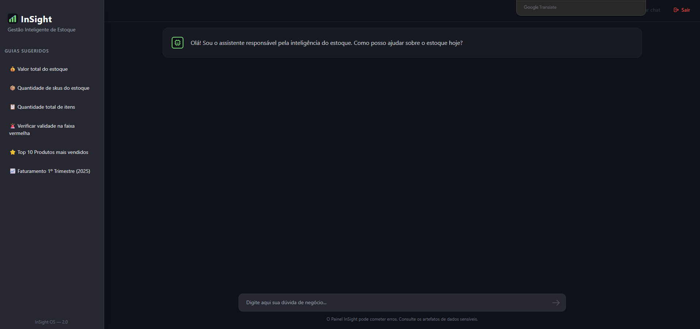
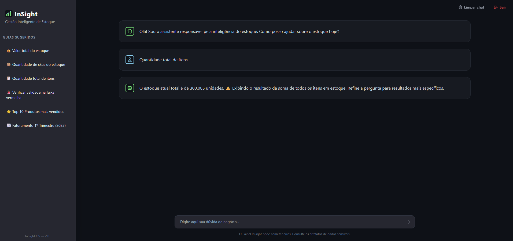

# InSight - Democratizando o Acesso aos Dados

## Introdução
O **InSight** começou como um caso de uso prático focado na gestão inteligente de estoque, mas seu propósito principal é muito mais abrangente: ele foi desenhado para ser um **motor de democratização de dados**. 

Por meio de uma interface simples em formato de chat, o usuário digita perguntas na sua própria linguagem natural (como *"quais foram as maiores saídas de ontem?"*) e o sistema compreende a intenção, varre o banco de dados e retorna a resposta em texto de forma imediata e limpa.

## Objetivo do Projeto
O objetivo central deste ecossistema é atuar como uma "ponte" entre equipes de negócio (não-técnicas) e as bases de dados das empresas. Queremos provar que a extração de dados valiosos não precisa estar limitada apenas a quem sabe programar ou dominar a linguagem SQL.

A palavra-chave do projeto é **adaptabilidade**. Apesar de utilizarmos o cenário de Logística e Estoque para materializar a ideia, este projeto **pode ser conectado e adaptado para quase qualquer outro segmento**. Seja no Financeiro, RH, Vendas ou Área da Saúde: bastando apontar a aplicação para uma nova base de dados, a Inteligência Artificial entra em ação e a InSight passa a ser a interface analítica daquele setor, trazendo total autonomia na obtenção de métricas diárias.

## Tecnologias Utilizadas
A arquitetura do projeto espelha esse objetivo de ser agnóstico e de fácil expansão:

**Front-end (Interface Visual):**
- **React (com Vite)** para uma interface de web leve, direta e sem barreiras de uso.
- **Node.js** para lidar com os pacotes e execução do ambiente visual em servidor do cliente.

**Back-end (A Inteligência):**
- **Python** e **FastAPI** (Uvicorn) entregando uma orquestração muito ágil nas conexões.
- **DuckDB** para gerenciamento robusto de consultas analíticas pesadas feitas no ambiente local.
- **Groq API (LLMs)** como a peça central que possibilita o "Text-to-SQL" — o cérebro que entende linguagem humana e traduz perfeitamente para comandos de resgate no banco.

## Galeria do Projeto

<div align="center">
  

  
</div>

## Como Rodar o Projeto (Setup)

Caso queira ver esse motor rodando localmente (com os dados simulados do nosso caso de uso de estoques), você precisará ativar separadamente o Back-end e o Front-end:

### 1. Preparando a Inteligência (Backend)
No seu terminal, vá para a pasta `backend` e crie um arquivo chamado `.env` baseando-se no exemplar `.env.example`. Insira sua própria chave de serviços LLM nele (`GROQ_API_KEY`).

Crie um ambiente virtual Python para isolar sua instalação:
```bash
cd backend
python -m venv venv
venv\Scripts\activate  # Comando para Windows (Se usar Linux/Mac: source venv/bin/activate)
pip install -r requirements.txt
```

### 2. Semeando a Base Teste (DuckDB)
Gere a estrutura da base analítica que será lida rodando os dois roteiros rápidos a seguir:
```bash
python scripts/setup_duckdb.py
python scripts/seed_duckdb.py
```

### 3. Ligando a Interface com o Banco
Basta subir nosso servidor de lógica com o ambiente ativado:
```bash
uvicorn api:app --host 0.0.0.0 --port 8000 --reload
```
A API está online e no aguardo.

### 4. Ligando as Telas (Frontend)
Abra um **novo** terminal (deixe o da API lá), vá à pasta do front e instale as ferramentas necessárias para rodar localmente no seu navegador:
```bash
cd frontend
npm install
npm run dev
```
Dê um clique no link que surgir no terminal (geralmente `http://localhost:5173`).

> **Usuário Teste:** Na pequena tela de acesso inicial, você pode usar as credenciais: login `admin` e senha `admin`.

## Conclusão
O InSight prova que a complexidade da extração de dados estruturados pode — e deve — ser ocultada atrás de boas camadas de IA. Muito além de monitorar o movimento da logística local, este é um **caso consolidado e escalável** de como ferramentas tecnológicas corretas removem barreiras de interpretação. Ao adotar esse formato limpo, validamos um caminho poderoso para impulsionar qualquer equipe de negócio rumo a uma gestão verdadeiramente guiada por dados.
